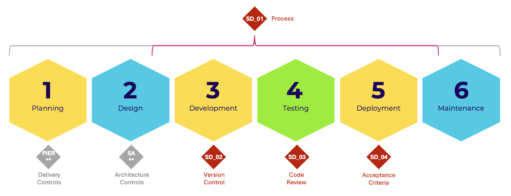

# Overview

Engineering maintains four auditable controls to demonstrate adherence to our
software development lifecycle. These work in partnership with delivery,
architecture and operations controls to support our technology platforms. It is
**expected** each service **developed using company-managed source code or
configuration** will, **as a minimum, adhere to these controls**.

## [SD_01 - Software Development Process](02-sd-01.md)

Ensures that company-managed software is developed against a defined software
development lifecycle process. Service owners provide annual attestation
confirming their services follow the company-agreed SDLC.

## [SD_02 - Software Development Version Control](03-sd-02.md)

Verifies that company-managed source code and configuration is kept in an
approved version control system. This control ensures proper code management
and traceability through authorized VCS platforms.

## [SD_03 - Software Development Code Review](04-sd-03.md)

Mandates that company-managed source code is reviewed independently of the
author for readability, quality, complexity and security. Engineering teams
determine the review approach while ensuring segregation of duties.

## [SD_04 - Software Development Release Acceptance](05-sd-04.md)

Establishes a formal acceptance process for changes to company-managed source
code before production release. This control ensures proper approval and
documentation of software changes through the change management process.
