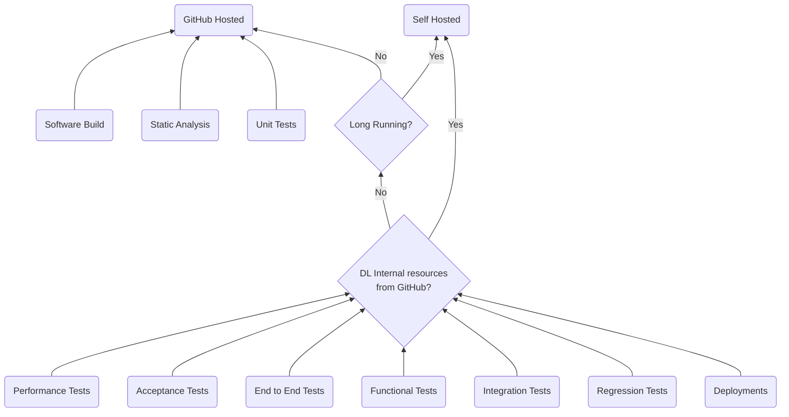

# Pipelines

In DL, GitHub Actions is the preferred tool for any Continuous
Integration/Delivery or Deployment (CI/CD) pipelines for all types of
configuration.

## Why Actions?

1. Built directly into GitHub and they integrate seamlessly our code repositories.
   So why go anywhere else to get your build, test and deployment results?
1. We can build workflows for various tasks, from CI/CD to automation
   of project management, notifications, and more.
1. Workflows are defined in YAML which are easy to read and modify.
1. Matrix builds are supported, enabling us to test code across multiple
   environments, versions, or configurations simultaneously.
1. GitHub Marketplace offers many pre-built actions to get us started quickly.
1. Actions have secrets management built in at the repository and environment
   level.
1. We can trigger workflows on various events e.g. push, pull requests, issues,
   tags, releases that automates our processes efficiently.
1. Workflows can be built once and shared with others. See [here](https://github.com/Direct-Line-Group/se-reusable-workflows)
   and [here](https://github.com/Direct-Line-Group/engprod-reusable-workflows)
   for an existing repository with several.
1. Public and private resources can be accessed.
1. `OpenID Connect` is supported to securely access your cloud services and the
   use of **long-lived access keys is actively discouraged.** If you would like to
   add the GitHub provider (or Terraform Cloud) to your AWS Control Tower account
   this is currently centrally managed through an AWSCP [repository](https://github.com/Direct-Line-Group/engprod-oidc-providers).

## GitHub hosted runner or self-hosted?

:::tip
`DL Internal` is defined as internal DL infrastructure
which is hosted through a Virtual Private Cloud private subnet or endpoint.
Therefore a platform or service is not publicly accessible from GitHub.

`Deployments` is defined as updating your infrastructure, service application/api
code, host configuration etc.
:::

:::info
Self-hosted runners are currently not a central managed service in DL, as such
several teams are maintaining their own infrastructure. A guide to our preferred
patterns using AWS CodeBuild can be found [here](./03-selfhosted.md).
:::

### Useful References

- [About runners](https://docs.github.com/en/actions/using-github-hosted-runners/using-github-hosted-runners/about-github-hosted-runners)
- [Workflows quick start](https://docs.github.com/en/actions/writing-workflows/quickstart)
- [OpenID Connect](https://docs.github.com/en/actions/security-for-github-actions/security-hardening-your-deployments/about-security-hardening-with-openid-connect#overview-of-openid-connect)
- [Workflow event triggers](https://docs.github.com/en/actions/writing-workflows/choosing-when-your-workflow-runs/events-that-trigger-workflows)
- [Sharing workflows](https://docs.github.com/en/actions/sharing-automations/avoiding-duplication)
- [Secrets in actions](https://docs.github.com/en/actions/security-for-github-actions/security-guides/using-secrets-in-github-actions)
